visualization
================

``` r
library(tidyverse)
```

    ## -- Attaching packages ------------------------------------------------------------------------------------------------------------------------------- tidyverse 1.3.0 --

    ## v ggplot2 3.3.2     v purrr   0.3.4
    ## v tibble  3.0.1     v dplyr   1.0.2
    ## v tidyr   1.1.0     v stringr 1.4.0
    ## v readr   1.3.1     v forcats 0.5.0

    ## -- Conflicts ---------------------------------------------------------------------------------------------------------------------------------- tidyverse_conflicts() --
    ## x dplyr::filter() masks stats::filter()
    ## x dplyr::lag()    masks stats::lag()

``` r
library(patchwork)
```

Load the weather data
---------------------

``` r
weather_df = 
  rnoaa::meteo_pull_monitors(
    c("USW00094728", "USC00519397", "USS0023B17S"),
    var = c("PRCP", "TMIN", "TMAX"), 
    date_min = "2017-01-01",
    date_max = "2017-12-31") %>%
  mutate(
    name = recode(
      id, 
      USW00094728 = "CentralPark_NY", 
      USC00519397 = "Waikiki_HA",
      USS0023B17S = "Waterhole_WA"),
    tmin = tmin / 10,
    tmax = tmax / 10) %>%
  select(name, id, everything())
```

    ## Registered S3 method overwritten by 'hoardr':
    ##   method           from
    ##   print.cache_info httr

    ## using cached file: C:\Users\YULIU\AppData\Local\Cache/R/noaa_ghcnd/USW00094728.dly

    ## date created (size, mb): 2020-10-01 11:31:33 (7.534)

    ## file min/max dates: 1869-01-01 / 2020-09-30

    ## using cached file: C:\Users\YULIU\AppData\Local\Cache/R/noaa_ghcnd/USC00519397.dly

    ## date created (size, mb): 2020-10-01 11:31:56 (1.703)

    ## file min/max dates: 1965-01-01 / 2020-03-31

    ## using cached file: C:\Users\YULIU\AppData\Local\Cache/R/noaa_ghcnd/USS0023B17S.dly

    ## date created (size, mb): 2020-10-01 11:32:09 (0.879)

    ## file min/max dates: 1999-09-01 / 2020-09-30

``` r
weather_df
```

    ## # A tibble: 1,095 x 6
    ##    name           id          date        prcp  tmax  tmin
    ##    <chr>          <chr>       <date>     <dbl> <dbl> <dbl>
    ##  1 CentralPark_NY USW00094728 2017-01-01     0   8.9   4.4
    ##  2 CentralPark_NY USW00094728 2017-01-02    53   5     2.8
    ##  3 CentralPark_NY USW00094728 2017-01-03   147   6.1   3.9
    ##  4 CentralPark_NY USW00094728 2017-01-04     0  11.1   1.1
    ##  5 CentralPark_NY USW00094728 2017-01-05     0   1.1  -2.7
    ##  6 CentralPark_NY USW00094728 2017-01-06    13   0.6  -3.8
    ##  7 CentralPark_NY USW00094728 2017-01-07    81  -3.2  -6.6
    ##  8 CentralPark_NY USW00094728 2017-01-08     0  -3.8  -8.8
    ##  9 CentralPark_NY USW00094728 2017-01-09     0  -4.9  -9.9
    ## 10 CentralPark_NY USW00094728 2017-01-10     0   7.8  -6  
    ## # ... with 1,085 more rows

\#\# Remember this plot ..?

``` r
weather_df %>% 
  ggplot(aes(x = tmin, y = tmax, color = name)) +
  geom_point(alpha = .5)
```

    ## Warning: Removed 15 rows containing missing values (geom_point).

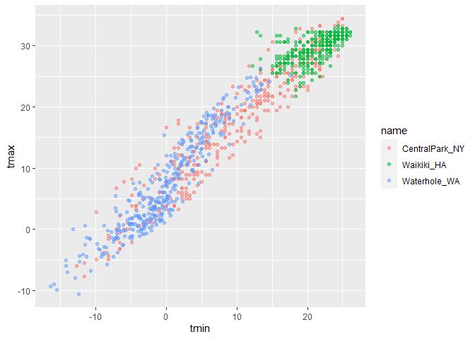

\#\# Labels

``` r
weather_df %>% 
  ggplot(aes(x = tmin, y = tmax, color = name)) +
  geom_point(alpha = .5) +
  labs(
    title = 'Temperature plot 1', 
    x = 'Minimum daily temperature(C)',
    y = 'Maximum daily tempetature(C)',
    caption = 'Data from rnoaa package, temperature in 2017.'
  )
```

    ## Warning: Removed 15 rows containing missing values (geom_point).

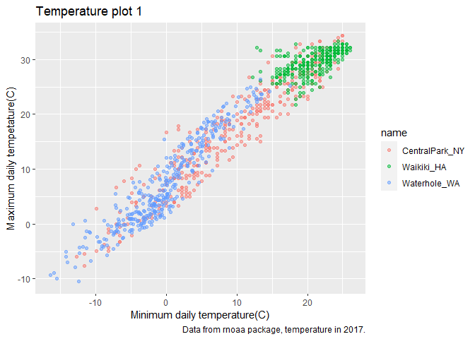

Scales
------

Start with the same plot, x and y scales

``` r
weather_df %>% 
  ggplot(aes(x = tmin, y = tmax, color = name)) +
  geom_point(alpha = .5) +
  labs(
    title = 'Temperature plot 1', 
    x = 'Minimum daily temperature(C)',
    y = 'Maximum daily tempetature(C)',
    caption = 'Data from rnoaa package, temperature in 2017.'
  ) +
  scale_x_continuous(
    breaks = c(-15, 0, 15), 
    labels = c('-15 C', '0', '15')
  ) +
  scale_y_continuous(
    #trans = 'log'
    position = 'right'
  )
```

    ## Warning: Removed 15 rows containing missing values (geom_point).

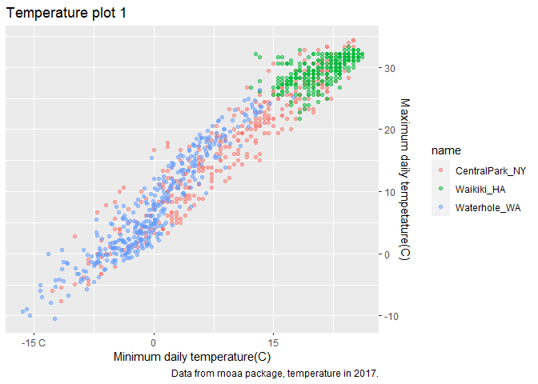

Look at color scales

``` r
weather_df %>% 
  ggplot(aes(x = tmin, y = tmax, color = name)) +
  geom_point(alpha = .5) +
  labs(
    title = 'Temperature plot 1', 
    x = 'Minimum daily temperature(C)',
    y = 'Maximum daily tempetature(C)',
    caption = 'Data from rnoaa package, temperature in 2017.'
  ) +
#   scale_color_hue(
#   name = 'Location',
#   h = c(100, 300))
   viridis::scale_color_viridis(
     name = 'Location',
     discrete = TRUE
   )
```

    ## Warning: Removed 15 rows containing missing values (geom_point).

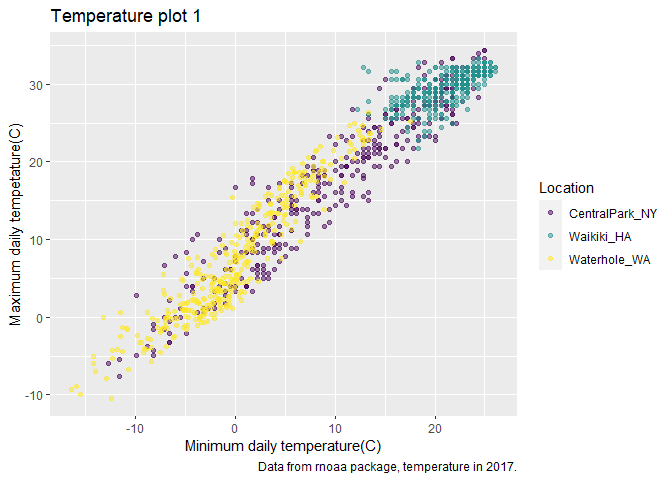

Themes
------

Shift the legend.

``` r
weather_df %>% 
  ggplot(aes(x = tmin, y = tmax, color = name)) +
  geom_point(alpha = .5) +
  labs(
    title = 'Temperature plot 1', 
    x = 'Minimum daily temperature(C)',
    y = 'Maximum daily tempetature(C)',
    caption = 'Data from rnoaa package, temperature in 2017.'
  ) +
#   scale_color_hue(
#   name = 'Location',
#   h = c(100, 300))
   viridis::scale_color_viridis(
     name = 'Location',
     discrete = TRUE) +
  theme(legend.position = 'bottom')
```

    ## Warning: Removed 15 rows containing missing values (geom_point).

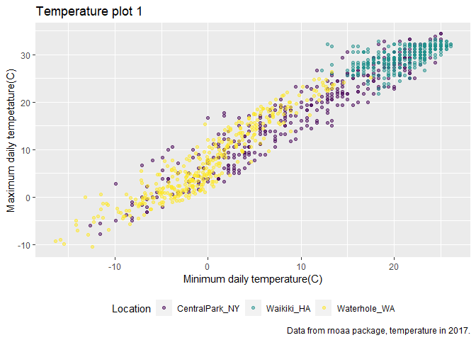

Change the overall theme.

``` r
weather_df %>% 
  ggplot(aes(x = tmin, y = tmax, color = name)) +
  geom_point(alpha = .5) +
  labs(
    title = 'Temperature plot 1', 
    x = 'Minimum daily temperature(C)',
    y = 'Maximum daily tempetature(C)',
    caption = 'Data from rnoaa package, temperature in 2017.'
  ) +
#   scale_color_hue(
#   name = 'Location',
#   h = c(100, 300))
   viridis::scale_color_viridis(
     name = 'Location',
     discrete = TRUE) +
#  theme_bw()
   theme_minimal() + ##this will eliminate all things themes before
   theme(legend.position = 'bottom')
```

    ## Warning: Removed 15 rows containing missing values (geom_point).


``` r
#  ggthemes::theme_economist_pal()
```

Setting options
---------------

``` r
library(tidyverse)

knit::opts_chunk&set(
  fig.width = 6,
  fig.asp = .6, 
  out.width = '90%'
)

theme_set(theme_minimal() + theme(legend.position = 'bottom'))  #apply this theme setting everywhere in this document

options(
  ggplot2.continuous.color = 'viridis',
  ggplot2.continuous.fill = 'viridis'
)

scale_color_discrete = scale_color_viridis_d
scale_fill_discrete = scale_fill_viridis_d
```

Data args in 'geom'
-------------------

``` r
central_park = 
  weather_df %>% 
  filter(name == 'CentralPark_NY')

waikiki = 
  weather_df %>% 
  filter(name == 'Waikiki_HA')

ggplot(data = waikiki, aes(x = date, y = tmax, color = name)) +
  geom_point() +
  geom_line(data = central_park)
```

    ## Warning: Removed 3 rows containing missing values (geom_point).

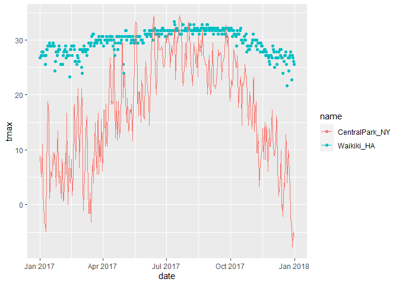

'patch work\`
-------------

remenber faceting?

``` r
weather_df %>% 
  ggplot(aes(x = tmin, fill = name)) +
  geom_density(alpha = .5) +
  facet_grid(.~name)
```

    ## Warning: Removed 15 rows containing non-finite values (stat_density).

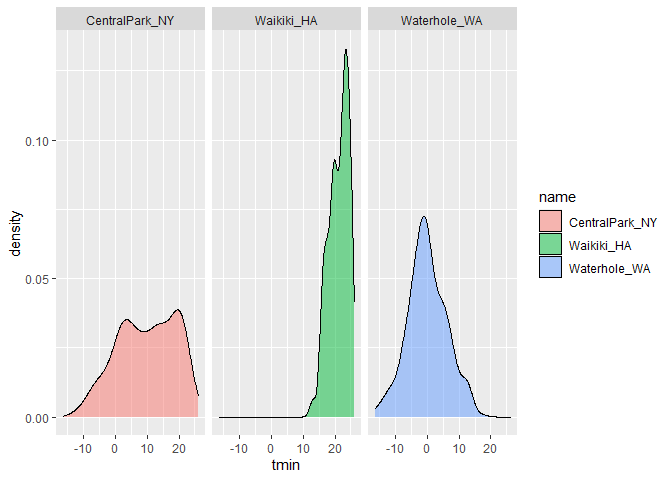

what happens when you want multipannel plots but can't facet ...?

``` r
tmax_tmin_p = 
  weather_df %>% 
  ggplot(aes(x = tmin, y = tmax, color = name)) +
  geom_point(alpha = .5) + 
  theme(legend.position = 'none')

prcp_dens_p = 
  weather_df %>% 
  filter(prcp > 0) %>% 
  ggplot(aes(x = prcp, fill = name)) +
  geom_density(alpha = .5) + 
  theme(legend.position = 'none')

tmax_date_p = 
  weather_df %>% 
  ggplot(aes(x = date, y = tmax, color = name)) +
  geom_point() +
  geom_smooth(se = FALSE) +
  theme(legend.position = 'none')

##get all these plots together
tmax_tmin_p + prcp_dens_p + tmax_date_p 
```

    ## Warning: Removed 15 rows containing missing values (geom_point).

    ## `geom_smooth()` using method = 'loess' and formula 'y ~ x'

    ## Warning: Removed 3 rows containing non-finite values (stat_smooth).

    ## Warning: Removed 3 rows containing missing values (geom_point).

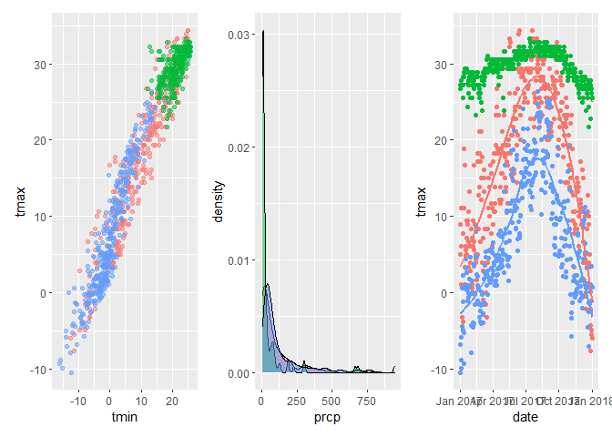

``` r
tmax_tmin_p + (prcp_dens_p + tmax_date_p)
```

    ## Warning: Removed 15 rows containing missing values (geom_point).

    ## `geom_smooth()` using method = 'loess' and formula 'y ~ x'

    ## Warning: Removed 3 rows containing non-finite values (stat_smooth).

    ## Warning: Removed 3 rows containing missing values (geom_point).


``` r
tmax_tmin_p / (prcp_dens_p + tmax_date_p) 
```

    ## Warning: Removed 15 rows containing missing values (geom_point).

    ## `geom_smooth()` using method = 'loess' and formula 'y ~ x'

    ## Warning: Removed 3 rows containing non-finite values (stat_smooth).

    ## Warning: Removed 3 rows containing missing values (geom_point).

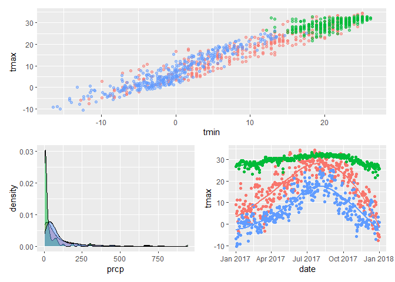

``` r
(tmax_tmin_p + prcp_dens_p) / tmax_date_p 
```

    ## Warning: Removed 15 rows containing missing values (geom_point).

    ## `geom_smooth()` using method = 'loess' and formula 'y ~ x'

    ## Warning: Removed 3 rows containing non-finite values (stat_smooth).

    ## Warning: Removed 3 rows containing missing values (geom_point).

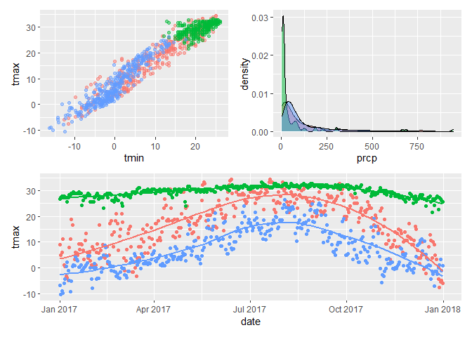

Data manipulation
-----------------

Control your factors

``` r
weather_df %>% 
  mutate(
    name = factor(name),
    name = forcats::fct_relevel(name, c('Waikiki_HA'))
  ) %>% 
  ggplot(aes(x = name, y = tmax, fill = name)) +
  geom_violin(alpha = .5)
```

    ## Warning: Removed 3 rows containing non-finite values (stat_ydensity).

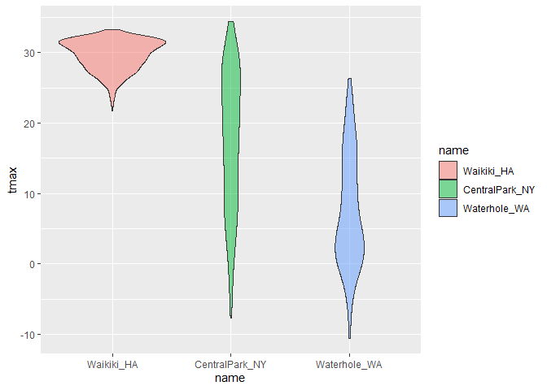

What if I wanted densities for tmin and tmax simultaneously?

``` r
weather_df %>% 
 
  pivot_longer(
    tmax:tmin,
    names_to = 'observation', 
    values_to = 'temperatures'
  ) %>% 
  ggplot(aes(x = temperatures, fill = observation)) +
  geom_density(alpha = .5) +
  facet_grid(.~name)
```

    ## Warning: Removed 18 rows containing non-finite values (stat_density).

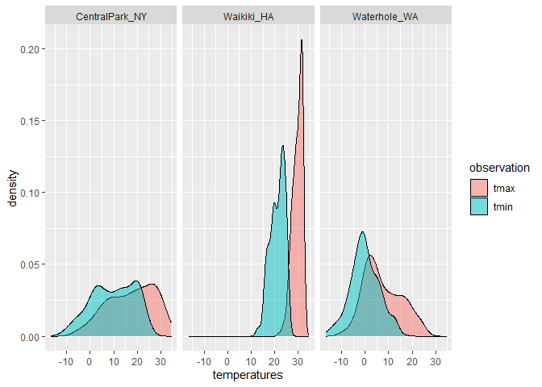
